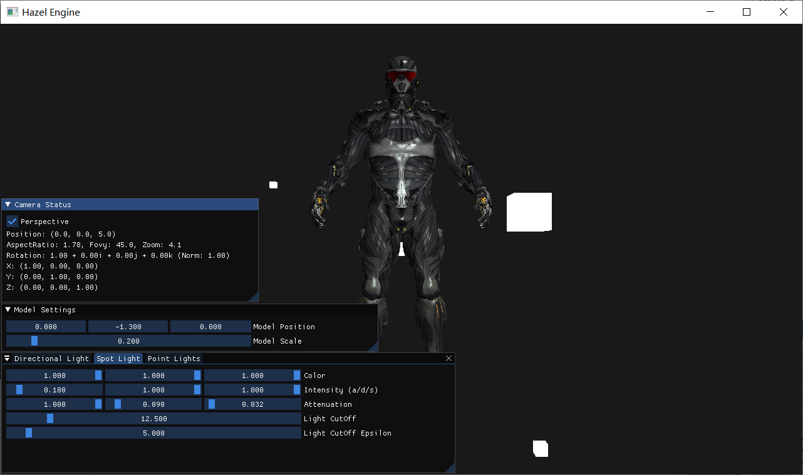

# Hazel

Watch a demo video on: https://www.bilibili.com/video/BV1GT411q76M

Hazel Engine with 3D rendering implemented.
- Typing "W" or "S" to move forward or backward.
- Dragging the mouse with right button pressed to rotate the camera.
- Dragging the mouse with middle button pressed to move the camera.
- Changing the light attributes on the imgui panels.

## Getting Started
**Step 1:** Clone this repository with *submodules*:
```bash
git clone --recursive-submodules git@github.com:mikudehuane/Hazel3D.git
```

**Step 2:** Generate project files by clicking on [scripts/Win-GenerateProjects.bat](scripts/Win-GenerateProjects.bat)

**Step 3:** Download the models files from [OpenGL tutorial](https://learnopengl-cn.github.io/data/nanosuit.rar), and extract it into [Sandbox/assets/models/nanosuit/](Sandbox/assets/models/nanosuit/).

**Step 4:** Open the solution file [Hazel3D.sln](Hazel.sln) and build the project.
